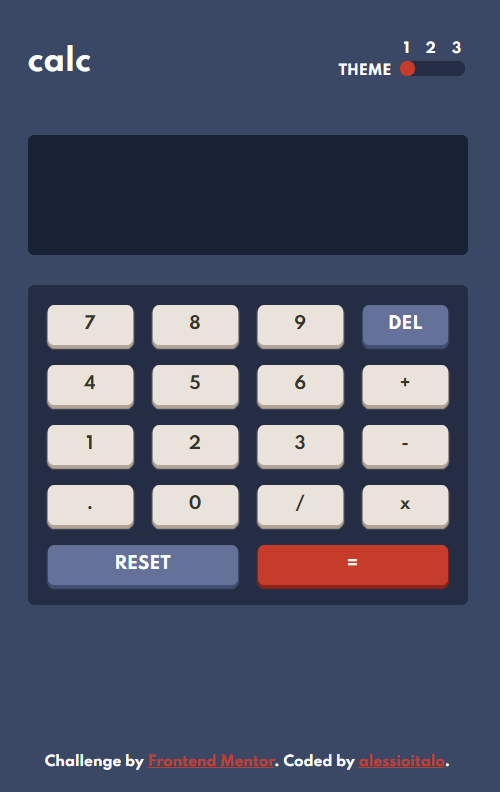
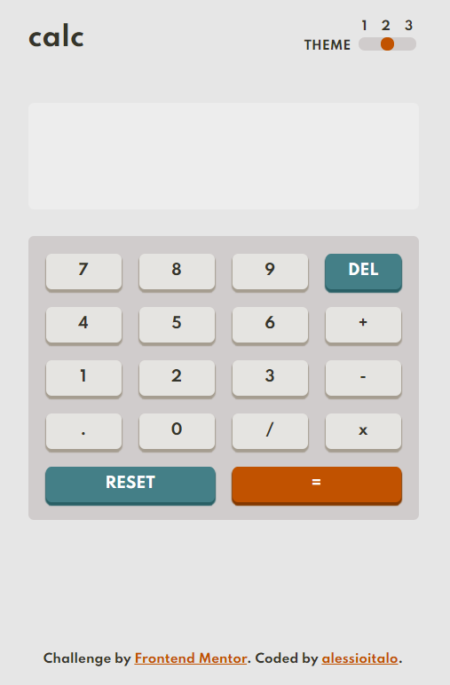
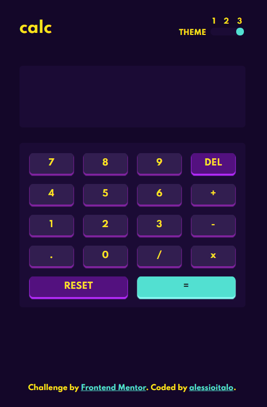

# Frontend Mentor - Calculator app solution

This is a solution to the [Calculator app challenge on Frontend Mentor](https://www.frontendmentor.io/challenges/calculator-app-9lteq5N29). Frontend Mentor challenges help you improve your coding skills by building realistic projects.

## Table of contents

- [Overview](#overview)
  - [The challenge](#the-challenge)
  - [Screenshot](#screenshot)
  - [Links](#links)
- [My process](#my-process)
  - [Built with](#built-with)
  - [What I learned](#what-i-learned)
  - [Useful resources](#useful-resources)
- [Author](#author)

## Overview

### The challenge

Users should be able to:

- See the size of the elements adjust based on their device's screen size
- Perform mathmatical operations like addition, subtraction, multiplication, and division
- Adjust the color theme based on their preference

### Screenshot

  

  

### Links

- Solution URL: [https://www.frontendmentor.io/solutions/reactreduxcalculatorapp-e1eLgDnJD](https://www.frontendmentor.io/solutions/reactreduxcalculatorapp-e1eLgDnJD)
- Live Site URL: [https://vercel.com/alessioitalo/react-redux-calculator](https://vercel.com/alessioitalo/react-redux-calculator)

## My process

### Built with

- Semantic HTML5 markup
- CSS custom properties
- Flexbox
- CSS Grid
- [React](https://reactjs.org/)
- [Styled Components](https://styled-components.com/)
- [MathJS](https://mathjs.org/)
- [React-Redux](https://react-redux.js.org/)
- [Redux-Toolkit](https://redux-toolkit.js.org/)

### What I learned

This was my first attempt in solving this Frontend Challenge by using Redux. I found it extremely useful when it comes to switching themes.

### Useful resources

- [StackOverflow - How to find and replace consecutive operators in a string](https://stackoverflow.com/questions/59559066/find-consecutive-operators-in-a-string-and-replace-previous-operator-with-latest)
- [StackOvervlow - How to change the input slider thumb colour](https://stackoverflow.com/questions/56851845/how-to-change-the-input-slider-thumb-colour-depending-on-value)

## Author

- Frontend Mentor - [@yourusername](https://www.frontendmentor.io/profile/alessioitalo)
- Twitter - [@yourusername](https://www.twitter.com/alessioitalo)